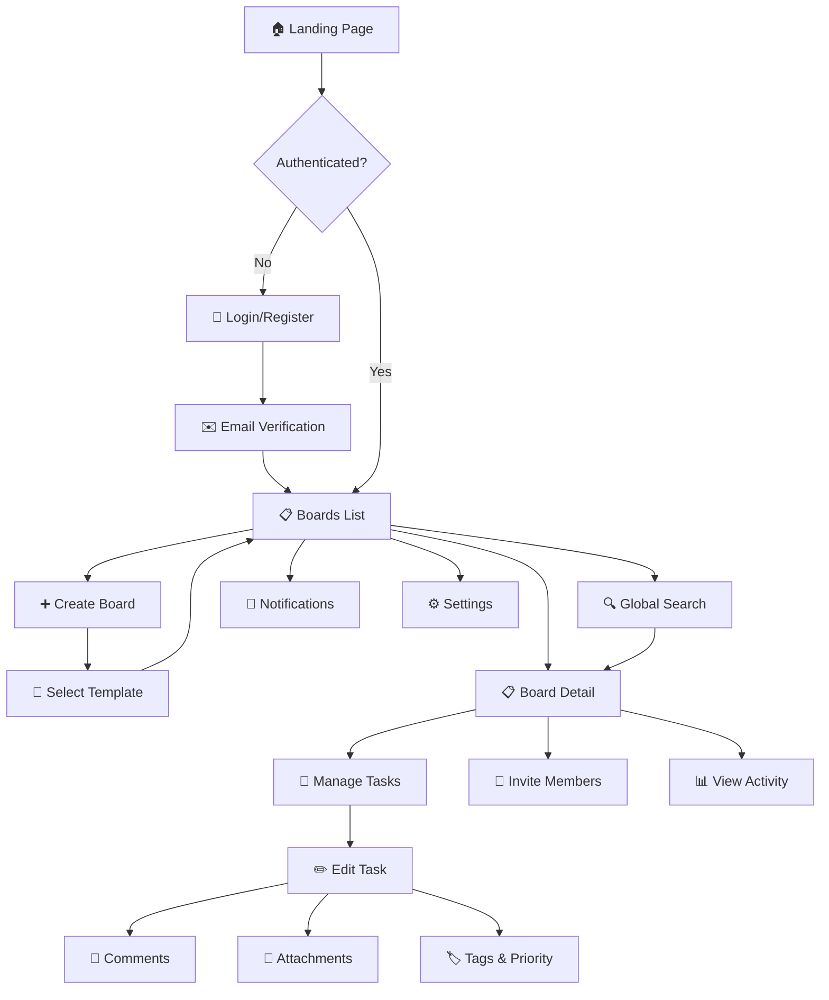
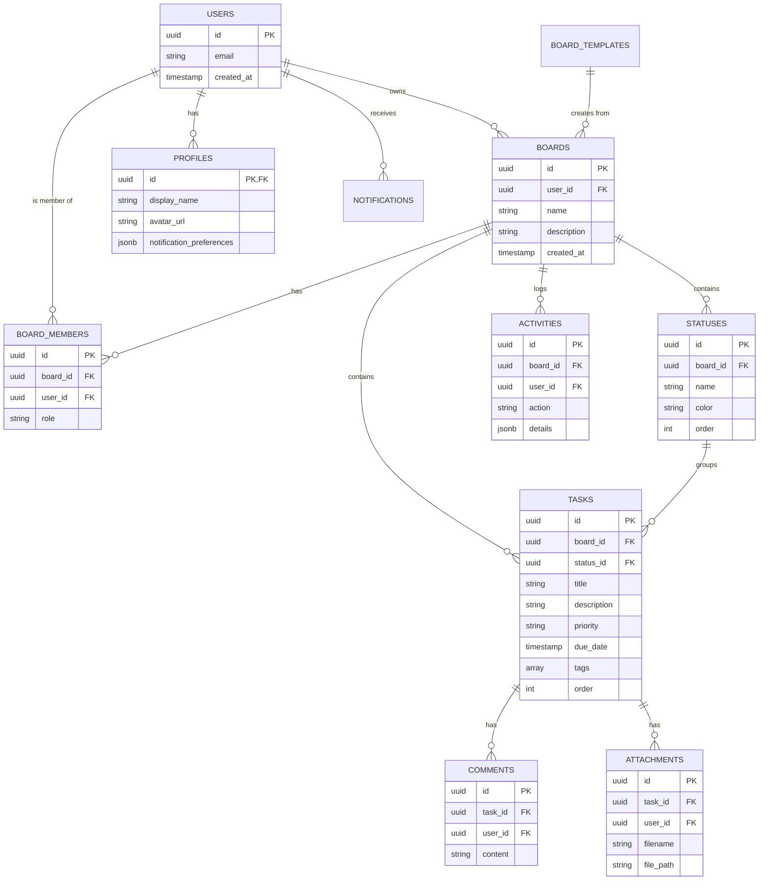
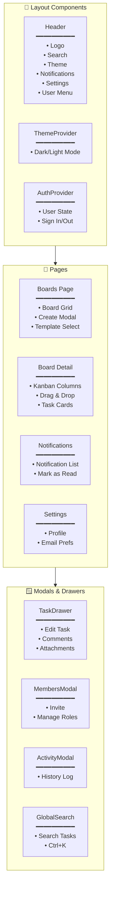
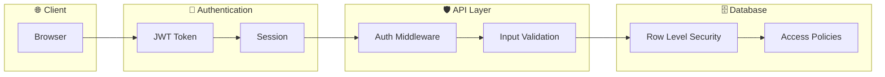

# KanbanPro Architecture

## Application Overview

```
┌─────────────────────────────────────────────────────────────────────────────┐
│                              KanbanPro                                       │
│                     Modern Kanban Board Application                          │
├─────────────────────────────────────────────────────────────────────────────┤
│  ┌─────────┐  ┌─────────┐  ┌─────────┐  ┌─────────┐  ┌─────────┐           │
│  │  Boards │  │  Tasks  │  │ Members │  │ Search  │  │Settings │           │
│  └─────────┘  └─────────┘  └─────────┘  └─────────┘  └─────────┘           │
│       │            │            │            │            │                  │
│       └────────────┴────────────┴────────────┴────────────┘                  │
│                                 │                                            │
│                    ┌────────────┴────────────┐                               │
│                    │      Next.js App        │                               │
│                    │    (React + TypeScript) │                               │
│                    └────────────┬────────────┘                               │
│                                 │                                            │
│              ┌──────────────────┼──────────────────┐                         │
│              │                  │                  │                         │
│     ┌────────┴────────┐ ┌──────┴──────┐ ┌────────┴────────┐                 │
│     │   Supabase DB   │ │   Storage   │ │  Edge Functions │                 │
│     │  (PostgreSQL)   │ │   (Files)   │ │    (Emails)     │                 │
│     └─────────────────┘ └─────────────┘ └─────────────────┘                 │
└─────────────────────────────────────────────────────────────────────────────┘
```

---

## User Flow



---

## Database Schema



---

## Component Architecture



---

## API Routes

```
📁 /api
├── 📁 /boards
│   ├── GET     → List all boards (owned + shared)
│   ├── POST    → Create new board
│   │
│   └── 📁 /[boardId]
│       ├── GET     → Get board details
│       ├── PATCH   → Update board
│       ├── DELETE  → Delete board
│       │
│       ├── 📁 /activities
│       │   └── GET → Get activity history
│       │
│       ├── 📁 /members
│       │   ├── GET    → List members
│       │   ├── POST   → Invite member
│       │   └── 📁 /[memberId]
│       │       ├── PATCH  → Update role
│       │       └── DELETE → Remove member
│       │
│       ├── 📁 /statuses
│       │   ├── GET    → List statuses
│       │   ├── POST   → Create status
│       │   ├── 📁 /reorder
│       │   │   └── PATCH → Reorder statuses
│       │   └── 📁 /[statusId]
│       │       ├── PATCH  → Update status
│       │       └── DELETE → Delete status
│       │
│       └── 📁 /tasks
│           ├── GET    → List tasks
│           ├── POST   → Create task
│           ├── 📁 /reorder
│           │   └── PATCH → Reorder tasks
│           └── 📁 /[taskId]
│               ├── GET    → Get task
│               ├── PATCH  → Update task
│               ├── DELETE → Delete task
│               ├── 📁 /move
│               │   └── PATCH → Move to status
│               ├── 📁 /comments
│               │   ├── GET  → List comments
│               │   └── POST → Add comment
│               └── 📁 /attachments
│                   ├── GET    → List attachments
│                   ├── POST   → Upload file
│                   └── DELETE → Delete file
│
├── 📁 /notifications
│   ├── GET   → List notifications
│   └── PATCH → Mark as read
│
├── 📁 /profile
│   ├── GET   → Get profile
│   └── PATCH → Update profile
│
├── 📁 /search
│   └── GET → Global task search
│
└── 📁 /templates
    ├── GET  → List templates
    └── POST → Create template
```

---

## Feature Matrix

| Feature                    | Description                       | Status |
| -------------------------- | --------------------------------- | ------ |
| 🔐 **Authentication**      | Email/password with Supabase Auth | ✅     |
| 📋 **Boards**              | Create, edit, delete boards       | ✅     |
| 📊 **Kanban Columns**      | Custom statuses with colors       | ✅     |
| 🎯 **Tasks**               | Full CRUD with drag & drop        | ✅     |
| 🏷️ **Tags & Priority**     | Organize tasks                    | ✅     |
| 📅 **Due Dates**           | Task deadlines                    | ✅     |
| 👥 **Board Sharing**       | Invite members with roles         | ✅     |
| 💬 **Comments**            | Task discussions                  | ✅     |
| 📎 **Attachments**         | File uploads (10MB limit)         | ✅     |
| 📜 **Activity History**    | Audit log per board               | ✅     |
| 🔍 **Global Search**       | Search across all tasks           | ✅     |
| 📝 **Templates**           | Board templates                   | ✅     |
| 🌙 **Dark Mode**           | Theme switching                   | ✅     |
| 📱 **PWA**                 | Installable app                   | ✅     |
| 🔔 **Notifications**       | In-app notifications              | ✅     |
| ✉️ **Email Notifications** | Via Supabase Edge Functions       | ✅     |

---

## Tech Stack

```
┌─────────────────────────────────────────────────────────────┐
│                        Frontend                              │
├─────────────────────────────────────────────────────────────┤
│  Next.js 16      │  React 19       │  TypeScript           │
│  Tailwind CSS    │  Lucide Icons   │  React Hot Toast      │
│  @hello-pangea/dnd (Drag & Drop)                            │
└─────────────────────────────────────────────────────────────┘
                              │
                              ▼
┌─────────────────────────────────────────────────────────────┐
│                        Backend                               │
├─────────────────────────────────────────────────────────────┤
│  Supabase                                                    │
│  ├── PostgreSQL (Database)                                  │
│  ├── Auth (Authentication)                                  │
│  ├── Storage (File uploads)                                 │
│  ├── Edge Functions (Email)                                 │
│  └── Row Level Security (RLS)                               │
└─────────────────────────────────────────────────────────────┘
                              │
                              ▼
┌─────────────────────────────────────────────────────────────┐
│                       Deployment                             │
├─────────────────────────────────────────────────────────────┤
│  Vercel          │  Supabase Cloud  │  Resend (Email)       │
└─────────────────────────────────────────────────────────────┘
```

---

## Security



### Row Level Security (RLS)

- **Boards**: Users see only owned + shared boards
- **Tasks**: Access based on board membership
- **Comments**: Users can edit/delete own comments
- **Attachments**: Users can delete own attachments
- **Notifications**: Users see only their notifications

---

## Performance Optimizations

| Optimization           | Implementation                     |
| ---------------------- | ---------------------------------- |
| **Static Generation**  | Landing, Login, Register pages     |
| **Dynamic Rendering**  | Board pages with real-time data    |
| **Code Splitting**     | Automatic by Next.js               |
| **Image Optimization** | Next.js Image component            |
| **Database Indexes**   | On foreign keys and common queries |
| **Caching**            | Service Worker for offline support |

---

## Directory Structure

```
kanban_pasv/
├── 📁 e2e/                    # E2E tests (Playwright)
├── 📁 public/
│   ├── 📁 icons/              # PWA icons
│   ├── manifest.json          # PWA manifest
│   └── sw.js                  # Service worker
├── 📁 src/
│   ├── 📁 app/
│   │   ├── 📁 (dashboard)/    # Protected routes
│   │   │   ├── boards/
│   │   │   ├── notifications/
│   │   │   └── settings/
│   │   ├── 📁 api/            # API routes
│   │   ├── 📁 auth/           # Auth callback
│   │   ├── login/
│   │   ├── register/
│   │   ├── layout.tsx
│   │   └── page.tsx
│   ├── 📁 components/
│   │   ├── 📁 board/          # Board components
│   │   ├── GlobalSearch.tsx
│   │   ├── Header.tsx
│   │   └── ...
│   ├── 📁 contexts/           # React contexts
│   ├── 📁 lib/                # Utilities
│   └── 📁 types/              # TypeScript types
├── 📁 supabase/
│   └── 📁 functions/          # Edge Functions
├── .env.example
├── ARCHITECTURE.md            # This file
├── DATABASE.md
├── DEPLOYMENT.md
└── README.md
```

---

## Quick Start

```bash
# 1. Clone & Install
git clone <repo>
cd kanban_pasv
npm install

# 2. Setup environment
cp .env.example .env.local
# Edit .env.local with your Supabase credentials

# 3. Run locally
npm run dev

# 4. Open browser
open http://localhost:3000
```

---

<div align="center">

**Built with ❤️ using Next.js + Supabase**

[Live Demo](https://kanbanpro.vercel.app) · [Documentation](./DEPLOYMENT.md) · [Report Bug](https://github.com/issues)

</div>
