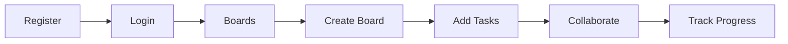

<div align="center">

# KanbanPro

### Modern Kanban Board for Team Collaboration

[](https://nextjs.org/)
[](https://www.typescriptlang.org/)
[](https://supabase.com/)
[](https://tailwindcss.com/)

[Live Demo](https://kanbanpro.vercel.app) · [Documentation](./DEPLOYMENT.md) · [Architecture](./ARCHITECTURE.md)

</div>

---

## Overview

```
┌──────────────────────────────────────────────────────────────────────┐
│                                                                      │
│   ┌─────────────┐  ┌─────────────┐  ┌─────────────┐  ┌───────────┐  │
│   │   Backlog   │  │    Todo     │  │ In Progress │  │   Done    │  │
│   ├─────────────┤  ├─────────────┤  ├─────────────┤  ├───────────┤  │
│   │ ┌─────────┐ │  │ ┌─────────┐ │  │ ┌─────────┐ │  │           │  │
│   │ │  Task   │ │  │ │  Task   │ │  │ │  Task   │ │  │           │  │
│   │ │ ─ ─ ─ ─ │ │  │ │ ─ ─ ─ ─ │ │  │ │ ─ ─ ─ ─ │ │  │           │  │
│   │ │ 🏷️ Tags │ │  │ │ 📅 Due  │ │  │ │ 👤 User │ │  │           │  │
│   │ └─────────┘ │  │ └─────────┘ │  │ └─────────┘ │  │           │  │
│   │ ┌─────────┐ │  │             │  │             │  │           │  │
│   │ │  Task   │ │  │             │  │             │  │           │  │
│   │ └─────────┘ │  │             │  │             │  │           │  │
│   └─────────────┘  └─────────────┘  └─────────────┘  └───────────┘  │
│                                                                      │
│   🔍 Search (Ctrl+K)    👥 Share    📊 Activity    ⚙️ Settings       │
│                                                                      │
└──────────────────────────────────────────────────────────────────────┘
```

---

## Features

| Feature                   | Description                                     |
| ------------------------- | ----------------------------------------------- |
| 📋 **Kanban Boards**      | Create unlimited boards with custom columns     |
| 🎯 **Drag & Drop**        | Intuitive task management                       |
| 👥 **Team Collaboration** | Invite members with roles (Admin/Member/Viewer) |
| 💬 **Comments**           | Discuss tasks with your team                    |
| 📎 **File Attachments**   | Upload files up to 10MB                         |
| 🔍 **Global Search**      | Find tasks across all boards (Ctrl+K)           |
| 📊 **Activity History**   | Track all changes                               |
| 📝 **Templates**          | Start with pre-built board templates            |
| 🌙 **Dark Mode**          | Easy on the eyes                                |
| 📱 **PWA Support**        | Install as native app                           |
| 🔔 **Notifications**      | Stay updated on changes                         |

---

## Quick Start

### 1. Clone & Install

```bash
git clone <repo-url>
cd kanban_pasv
npm install
```

### 2. Configure Environment

```bash
cp .env.example .env.local
```

Edit `.env.local`:

```env
NEXT_PUBLIC_SUPABASE_URL=https://your-project.supabase.co
NEXT_PUBLIC_SUPABASE_ANON_KEY=your-anon-key
```

### 3. Setup Supabase

1. Create project at [supabase.com](https://supabase.com)
2. Run SQL migrations from [DEPLOYMENT.md](./DEPLOYMENT.md)
3. Create `attachments` storage bucket

### 4. Run

```bash
npm run dev
```

Open [http://localhost:3000](http://localhost:3000)

---

## Tech Stack

```
┌─────────────────────────────────────────────────────┐
│                    Frontend                          │
├─────────────────────────────────────────────────────┤
│  Next.js 16  •  React 19  •  TypeScript  •  Tailwind│
└─────────────────────────────────────────────────────┘
                         │
                         ▼
┌─────────────────────────────────────────────────────┐
│                    Supabase                          │
├─────────────────────────────────────────────────────┤
│  PostgreSQL  •  Auth  •  Storage  •  Edge Functions │
└─────────────────────────────────────────────────────┘
```

---

## Project Structure

```
src/
├── app/
│   ├── (dashboard)/          # Protected routes
│   │   ├── boards/           # Board list & detail
│   │   ├── notifications/    # Notifications page
│   │   └── settings/         # User settings
│   ├── api/                  # API routes
│   ├── login/                # Auth pages
│   └── register/
├── components/
│   ├── board/                # Board components
│   │   ├── BoardMembersModal.tsx
│   │   ├── BoardActivityModal.tsx
│   │   ├── TaskDrawer.tsx
│   │   ├── TaskComments.tsx
│   │   └── TaskAttachments.tsx
│   ├── GlobalSearch.tsx
│   └── Header.tsx
├── contexts/                 # React contexts
├── lib/                      # Utilities
└── types/                    # TypeScript types
```

---

## User Flow



---

## API Routes

| Method   | Endpoint                | Description       |
| -------- | ----------------------- | ----------------- |
| `GET`    | `/api/boards`           | List all boards   |
| `POST`   | `/api/boards`           | Create board      |
| `GET`    | `/api/boards/:id`       | Get board         |
| `PATCH`  | `/api/boards/:id`       | Update board      |
| `DELETE` | `/api/boards/:id`       | Delete board      |
| `GET`    | `/api/boards/:id/tasks` | List tasks        |
| `POST`   | `/api/boards/:id/tasks` | Create task       |
| `GET`    | `/api/search`           | Global search     |
| `GET`    | `/api/notifications`    | Get notifications |

Full API documentation: [ARCHITECTURE.md](./ARCHITECTURE.md#api-routes)

---

## Scripts

```bash
npm run dev        # Start dev server
npm run build      # Production build
npm run start      # Start production
npm run lint       # Run ESLint
npm run test       # Run tests
npm run test:e2e   # Run E2E tests
```

---

## Board Templates

| Template                | Columns                                               |
| ----------------------- | ----------------------------------------------------- |
| 📋 **Kanban**           | Backlog → Todo → In Progress → Done                   |
| 🏃 **Scrum Sprint**     | Sprint Backlog → In Dev → Review → Testing → Done     |
| 🐛 **Bug Tracking**     | Reported → Confirmed → In Progress → Fixed → Verified |
| ✍️ **Content Pipeline** | Ideas → Drafting → Review → Published                 |

---

## Keyboard Shortcuts

| Shortcut        | Action             |
| --------------- | ------------------ |
| `Ctrl+K` / `⌘K` | Open global search |
| `Esc`           | Close modal/drawer |

---

## Documentation

- 📖 [Deployment Guide](./DEPLOYMENT.md) - Deploy to Vercel + Supabase
- 🏗️ [Architecture](./ARCHITECTURE.md) - System design & diagrams
- 🗄️ [Database Schema](./DATABASE.md) - Tables & relationships

---

## Contributing

1. Fork the repository
2. Create feature branch (`git checkout -b feature/amazing`)
3. Commit changes (`git commit -m 'Add amazing feature'`)
4. Push to branch (`git push origin feature/amazing`)
5. Open Pull Request

---

## License

MIT License - see [LICENSE](./LICENSE) for details.

---

<div align="center">

**Built with ❤️ by Ihor Peretiatko**

[⬆ Back to top](#kanbanpro)

</div>
